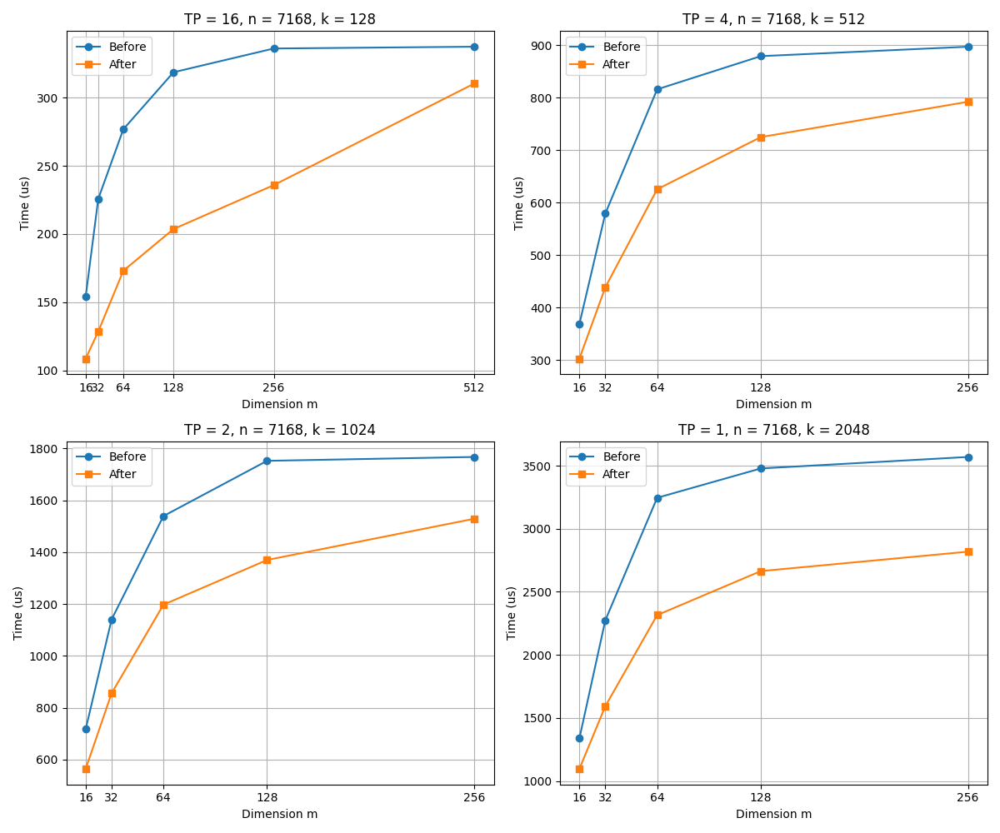

<!-- Copyright 2022 JD Co.
Licensed under the Apache License, Version 2.0 (the "License");
you may not use this project except in compliance with the License.
You may obtain a copy of the License at
    http://www.apache.org/licenses/LICENSE-2.0
Unless required by applicable law or agreed to in writing, software
distributed under the License is distributed on an "AS IS" BASIS,
WITHOUT WARRANTIES OR CONDITIONS OF ANY KIND, either express or implied.
See the License for the specific language governing permissions and
limitations under the License. -->

[English](./README.md) | [中文](./README_zh.md)

<div align="center">

    
[](https://xllm.readthedocs.io/zh-cn/latest/) [](https://hub.docker.com/r/xllm/xllm-ai) [](https://opensource.org/licenses/Apache-2.0) [](https://deepwiki.com/jd-opensource/xllm) 
    
</div>

---------------------
<p align="center">
| <a href="https://xllm.readthedocs.io/zh-cn/latest/"><b>Documentation</b></a> | 
</p>


## 1. 概述

XLLM OPS 是一个可扩展、高性能的算子库，专为大语言模型设计。

随着大语言模型的广泛应用，开发者在模型训练和推理过程中面临计算效率低和资源消耗高等挑战。这些问题使得开发者迫切需要一个高效的算子库，以提升性能并降低成本。

为此，我们设计了XLLM OPS，一个专注于性能优化的国产芯片算子库，旨在提供更快的计算速度和更低的资源消耗。

## 2. 快速开始
* 编译算子库
```bash
bash build.sh
```

## 3. 测试
```bash
cd test
export VCPKG_ROOT=/path/to/vcpkg
bash build.sh
./bin/group_gemm_gtest
```

## 4. 性能效果

* 优化后的GroupMatmul算子在计算时间上表现出明显的优势，尤其是在k为128，m为64情况下，如图所示，优化后算子耗时减少了50%
* 使用topKtopP融合算子后，在qwen2-0.5B模型中，TTOT下降37%,TTFT提升10%


## 5. 社区支持
如果你在xLLM的开发或使用过程中遇到任何问题，欢迎在项目的Issue区域提交可复现的步骤或日志片段。
如果您有企业内部Slack，请直接联系xLLM Core团队。另外，我们建立了一个微信群，可以在[这里](https://qr.link/JZaROS)找到我们的群聊二维码图片或访问以下活码。欢迎沟通和联系我们:

<div align="center">
  
  
</div>

## 6. 致谢
本项目的实现得益于以下开源项目:
- [cann-ops-adv](https://gitee.com/ascend/cann-ops-adv) - 采用了cann-ops-adv中的工程构建


## 7. 许可证
[Apache License]( ./LICENSE.md)

#### xLLM OPS由 JD.com 提供 


